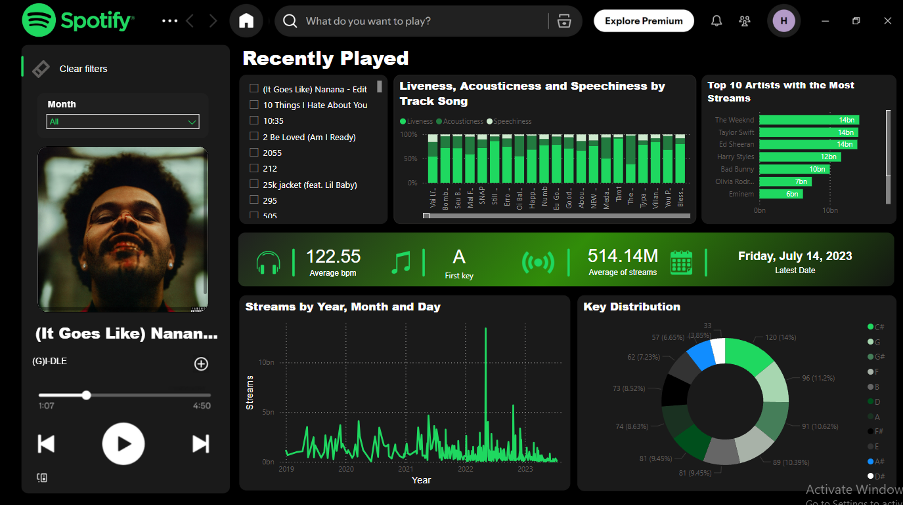

# 🎶 2023 Spotify Hits Dashboard

---

### **Problem Statement**
Music platforms generate massive amounts of data, making it challenging to quickly identify:
1.The most popular songs and artist trends.
2.The key audio attributes that drive a song's success (e.g., danceability, energy).

This project tackles the complexity arising from the 120,000 new songs uploaded to music platforms every day.

---

### 🚀 Dashboard Interaction

Experience the full interactive dashboard below.

#### [**View Dashboard**](https://app.powerbi.com/groups/me/reports/b1499c3f-3264-48ce-bb85-283631e1c66c?ctid=89a64acf-4e6e-493c-8bd5-64e9527e5296&pbi_source=linkShare&bookmarkGuid=17900146-dab4-413a-a1a1-b1c5f6dd0911)

---

### **Data Source & Scope**

This dashboard is built on a high-quality dataset featuring **953 popular tracks from 2023**.

| Metric Category | Key Data Points |
| :--- | :--- |
| **Track Performance** | Streams, presence in charts, and playlist features. |
| **Audio Attributes** | BPM, key, mode, danceability, valence, and energy . |
| **Contextual Data** | Track name, artist name, release date, and album information. |

---

### **Solution: Power BI Data Dashboard**

We created a visually appealing Power BI dashboard that converts streaming and audio characteristics into clear, actionable business intelligence.

| Solution Component | Description |
| :--- | :--- |
| **Data Visualization** | Highlights key metrics and trends using Power BI, ensuring easy-to-read and visually appealing insights. |
| **Advanced Tools** | Utilizes advanced custom visuals like **Deneb** and **HTML Content** for enhanced data presentation and dynamic chart capabilities. |

---

### **👥 Team Collaboration**

This project was developed by:

* **Angeline Ruin** 
* **Christian Harvey Cayanan** 
* **Haidee Adreanne Duarte**
